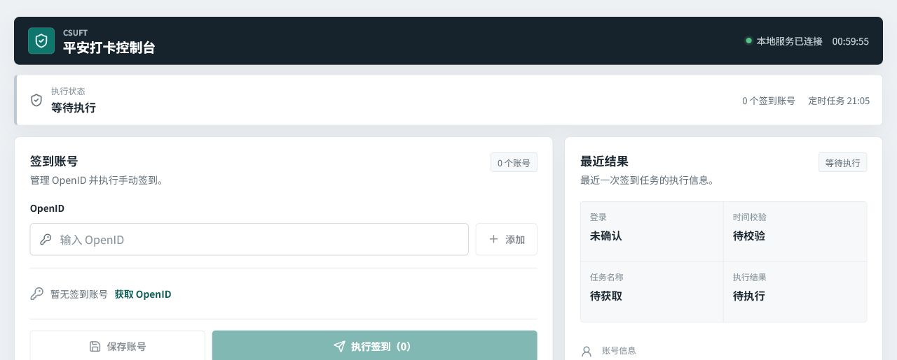
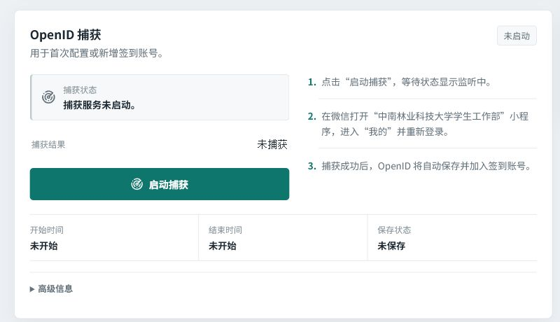
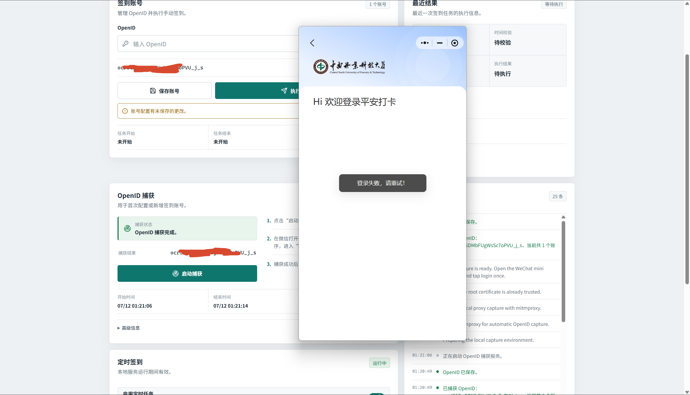
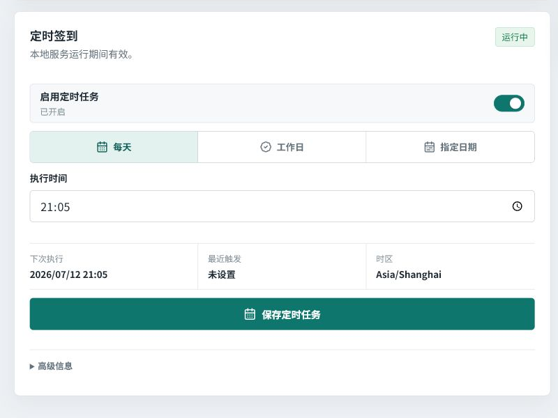

# 中南林业科技大学平安打卡（CSUFT 平安签到 / 平安打卡）

面向中南林业科技大学（CSUFT）的平安打卡自动化工具，使用 TypeScript 实现，支持 OpenID、多账号签到、定时任务和本地 Web 控制台。

**常用检索词：** 中南林业科技大学 平安打卡、中南林业科技大学 平安签到、中南林业科技大学 晚打卡、中南林业科技大学平安打卡、CSUFT 平安打卡。

> **项目来源：** 本项目最初 Fork 自 [186526/csuft-unsafe-dorm](https://github.com/186526/csuft-unsafe-dorm)，并在 [HeWhenJay/csuft-unsafe-dorm](https://github.com/HeWhenJay/csuft-unsafe-dorm) 中继续开发。为便于 GitHub 检索和独立维护，当前版本另行发布为非 Fork 网络仓库；原始作者、MIT 许可证和 Git 提交历史均予以保留。

## 项目功能

- 使用 OpenID 完成单账号或多账号签到
- 在本地控制台保存账号、执行签到并查看结果
- 支持黑夜/白昼模式和界面主题色选择，并记住本机偏好
- 通过 Windows 本地代理捕获 OpenID
- 配置每天、工作日或指定日期的定时签到
- 签到失败后允许补跑，同一天成功后自动去重
- 保存中文运行日志和定时任务日志

## 环境要求

### 基础运行环境

| 项目 | 要求 |
| --- | --- |
| 操作系统 | 使用已有 OpenID 时可运行于 Windows、macOS 或 Linux；一键捕获 OpenID 仅支持 Windows，建议 Windows 10/11 |
| Node.js | Node.js `20.19.x` 或 `22.12+`；推荐 Node.js 24 LTS |
| npm | 使用 Node.js 自带的 npm，建议 npm 10 或 11；Yarn 不是必需环境 |
| JavaScript 依赖 | 在仓库根目录执行 `npm install`，不要使用 `--omit=dev` |
| 浏览器 | 现代版 Edge、Chrome 或 Firefox，用于访问本地控制台 |
| 网络 | 首次安装依赖和执行签到时需要联网 |
| 文件权限 | 仓库目录需要可写，用于保存 `.env`、`.codex-tools/`、调度配置和日志 |

### 一键捕获 OpenID 的额外环境

| 项目 | 要求 |
| --- | --- |
| Windows | 捕获流程依赖 PowerShell、当前用户系统代理和证书库，因此仅支持 Windows |
| Python | 已有可用 `mitmdump` 时不需要；否则建议安装带 `venv` 和 `pip` 的标准 CPython 3.12+ |
| mitmproxy | 优先使用 PATH 中的 `mitmdump`；缺失时项目会自动安装到 `.codex-tools/mitmproxy/venv` |
| Windows 微信 | 需要安装并运行电脑版微信，打开“中南林业科技大学学生工作部”小程序后重新登录 |
| WMPFDebugger | 默认不启用；仅在设置 `ENABLE_WMPF_DEBUGGER_FALLBACK=1` 后作为备用捕获方案 |
| Git | 默认 mitmproxy 捕获不依赖 Git；自动安装 WMPFDebugger 备用方案时需要 Git |

> **捕获安全说明：** 首次捕获会把 mitmproxy CA 安装到当前用户根证书库，并临时将当前用户系统代理设置为 `127.0.0.1:8866`。捕获结束后程序会恢复原代理设置。请只在自己信任的 Windows 设备上执行。

### 本地端口

| 端口 | 用途 | 使用场景 |
| --- | --- | --- |
| `3001` | 后端 API 和控制台入口 | 启动项目后访问 `http://127.0.0.1:3001` |
| `4173` | Vite 开发服务器 | `npm run dev` |
| `8866` | mitmproxy 本地代理 | 捕获 OpenID |
| `62000` | WMPFDebugger WebSocket | 仅备用捕获方案 |

启动前请确认所需端口没有被其他程序占用。

## 快速开始

### 1. 安装依赖

```bash
npm install
```

根目录安装完成后会自动安装 `web/` 前端依赖。如果直接执行 `npm run dev`，项目也会检查并补装缺失的依赖。

### 2. 配置 OpenID

已有 OpenID 时，在项目根目录创建 `.env`：

```env
openid=你的openid
```

多账号使用英文逗号分隔：

```env
openid=openid_1,openid_2
```

没有 OpenID 时，可以先启动控制台，再使用页面中的“OpenID 捕获”。

### 3. 启动本地控制台

```bash
npm run dev
```

启动成功后访问：

```text
http://127.0.0.1:3001
```

控制台会显示本地服务状态、账号配置、最近结果、OpenID 捕获、定时签到和运行日志。



### 4. 捕获 OpenID

1. 在控制台中点击“启动捕获”。
2. 等待页面显示正在监听登录请求。
3. 在 Windows 微信中打开“中南林业科技大学学生工作部”小程序。
4. 进入“我的”并重新登录一次。
5. 捕获成功后，OpenID 会自动保存并加入签到账号。

第一次执行可能需要下载并安装 mitmproxy，耗时取决于当前网络。不要在捕获过程中手动关闭终端。



下面是 Windows 微信小程序重新登录后，控制台成功捕获并保存 OpenID 的实际效果。图中的账号标识已经遮挡。



### 5. 执行签到

确认签到账号无误后，点击“执行签到”。控制台会依次显示登录、时间校验、任务名称、执行结果和运行日志。

只运行命令行脚本时，可以执行：

```bash
npm run script
```

### 6. 配置定时签到

在“定时签到”区域选择每天、工作日或指定日期，设置执行时间后点击“保存定时任务”。

定时任务依赖本地后端进程持续运行；关闭 `npm run dev` 后，页面内的 `node-cron` 调度也会停止。



## 常用命令

| 命令 | 用途 |
| --- | --- |
| `npm run dev` | 同时启动后端 API 和 Vite 前端 |
| `npm run build` | 编译 TypeScript 后端 |
| `npm run build:web` | 构建前端静态文件 |
| `npm run script` | 使用 `.env` 中的 OpenID 手动签到 |
| `npm run script:schedule-runner` | 执行一次计划任务签到入口 |

## 日志位置

- 计划任务总日志：`scheduled-task.log`
- 每次自动签到的独立日志目录：`日志/`
- OpenID 捕获工具和运行文件：`.codex-tools/`

独立签到日志命名格式为：

```text
年-月-日-时-分-秒+结果.log
```

## 相关文档

- [命令行脚本与外部定时任务](./docs/running.md)
- [WMPFDebugger 备用捕获说明](./docs/openid.md)
- [请求签名机制分析](https://github.com/Feather-P/ahut-dorm-sign/blob/master/docs/%E8%AF%B7%E6%B1%82%E7%AD%BE%E5%90%8D%E6%9C%BA%E5%88%B6%E5%88%86%E6%9E%90.md)

## 使用与许可

本仓库仅供学习和研究使用，请勿用于任何非法用途。

使用者需自行承担使用后果与责任。

仓库维护者有权删除或拒绝可能导致违规滥用的实现与需求。

项目使用 [MIT License](./LICENSE)。
